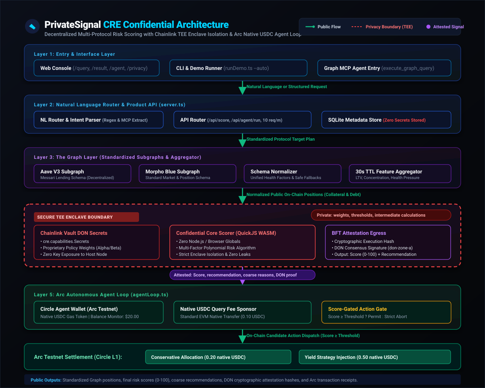

# PrivateSignal

> **Private risk intelligence for on-chain agents.**  
> Live multi-protocol data from The Graph enters a Chainlink TEE. A proprietary model scores it in confidential compute. Only a signed verdict leaves the enclave. Agents on Arc pay in native USDC and may act only if that attested score clears policy.

[](#tests)
[](https://chain.link)
[](https://thegraph.com)
[](https://arc.network)

---

## Why this exists

DeFi risk is public. **Risk strategy is not supposed to be.**

Positions, health factors, and collateral compositions are already visible on-chain. The valuable part is the *evaluation policy*:

- Which signals matter
- How they are weighted
- What thresholds trigger caution vs refusal
- How cross-protocol concentration is penalized

If that policy is public, it stops being an edge. Competitors copy it. Searchers anticipate it. Agents that depend on it leak intent before they move capital.

Most teams solve this by hiding the model on a centralized server. That restores secrecy and destroys verifiability.

**PrivateSignal is the missing middle:**

- **Public multi-protocol state** from The Graph
- **Private scoring** inside a Chainlink CRE Trusted Execution Environment (TEE)
- **Only an attested score** leaves the enclave
- **Arc agents pay for the score** in native USDC and are hard-gated by it

This is not a liquidation bot. It is **confidential decision infrastructure**.

---

## The core insight (especially for Chainlink)

Confidential Workflows are wasted when they only hide an API key or a boolean flag.

PrivateSignal hides the **decision model itself**.

```
┌─────────────────────────────────────────────────────────────────────────┐
│                      INSIDE THE ENCLAVE (SEALED)                        │
│  • Proprietary scoring weights (LTV, correlation, concentration)        │
│  • Private threshold matrices                                           │
│  • Intermediate penalties and cross-protocol feature math               │
│  • Policy profile behavior                                              │
└────────────────────────────────────┬────────────────────────────────────┘
                                     │  Cryptographic Attestation
                                     ▼
┌─────────────────────────────────────────────────────────────────────────┐
│                     OUTSIDE THE ENCLAVE (EMITTED)                       │
│  • Final score (0–100)                                                  │
│  • Coarse recommendation (safe / caution / high_risk)                   │
│  • Sanitized reason codes (HEALTH_FACTOR_OPTIMAL, LTV_WITHIN_LIMITS)      │
│  • Cryptographic attestation envelope (DON ID, execution hash, BFT sig) │
└─────────────────────────────────────────────────────────────────────────┘
```

**That boundary is the product.**

- If the TEE is removed, PrivateSignal has no durable edge.  
- If the score is not attested, agents have no trustworthy gate.  
- If the model is public, the strategy is already compromised.

This is exactly the class of problem CRE Confidential Workflows are for: **privacy-preserving risk assessment and policy enforcement**, where sensitive parameters and intermediate computation must remain sealed while the application still receives a usable, verifiable result.

---

## What PrivateSignal does

1. **Ingest live risk state** from standardized Graph subgraphs across protocols (Aave V3 and Morpho Blue).
2. **Route natural-language intent** through Graph MCP into structured multi-protocol queries.
3. **Score privately** inside a Chainlink CRE confidential handler using sealed model weights and policy thresholds from Vault DON secrets.
4. **Emit only an attested verdict** signed with enclave cryptographic attestation.
5. **Let an Arc agent pay in native USDC** and execute or abort an on-chain action based on that verdict.

> **Public data in. Private reasoning sealed. Signed decision out. Capital movement gated.**

---

## Why it is important

Autonomous agents are starting to allocate, rebalance, and sponsor actions on-chain. They need continuous risk judgment, but they cannot afford to publish the policy that makes that judgment valuable.

Without confidential compute, teams are forced into one of three failures:

1. **Publish the model** and lose alpha  
2. **Centralize the model** and lose verifiability  
3. **Skip policy entirely** and over-expose capital  

PrivateSignal makes a fourth path real:

> **Agents can consume a private risk policy as an attested service.**

That matters for treasuries, credit delegates, agentic allocators, and any system that needs **policy enforcement without policy disclosure**.

---

## Why it is unique

Most hackathon projects in this space do one of the following:

- Reskin a liquidation / rebalancing template
- Build an agent marketplace with payments
- Wrap subgraph chat around public data
- Hide credentials while leaving the decision logic public

PrivateSignal does something narrower and harder to dismiss:

- The secret is the **scoring model**, not just credentials
- The data path is **standardized multi-protocol Graph ingestion**, not one ad-hoc subgraph
- The output is an **attested decision artifact**, not a dashboard opinion
- Arc is not a tip jar; the score is a **binding gate** on agent action

Remove any one of those and the product collapses into something generic. Keep all four and it becomes infrastructure.

---

## Architecture Visual

[](docs/architecture.svg)

> *Click diagram to open full-resolution SVG: [docs/architecture.svg](docs/architecture.svg)*

---

## Why the confidential CRE portion is the load-bearing piece

### What CRE confidential execution gives us

Chainlink CRE lets sensitive workflow logic run inside a hardware-isolated TEE (Trusted Execution Environment) compiled to QuickJS WebAssembly (WASM).

In PrivateSignal that means:

- **Zero Memory Leaks**: Model coefficients never sit in app logs, client bundles, or operator-visible memory paths.
- **Dynamic Policy Profiles**: Threshold matrices differ between conservative, balanced, and aggressive profiles without exposing the threshold boundaries.
- **Sealed Intermediate Math**: Concentration penalties, cross-protocol pressure terms, and liquid staking correlation factors remain sealed inside the enclave.
- **Verifiable Output**: The downstream application receives a deterministic score and attestation proof it can verify on-chain before executing capital maneuvers.

### What we deliberately keep out of the enclave output

We do **not** return:

- Algorithmic weights
- Raw feature vectors
- Private threshold cutoffs
- Full internal mathematical traces

We return only what a downstream agent needs to act:

- **Score** (normalized 0–100 integer)
- **Recommendation** (`safe` / `caution` / `high_risk`)
- **Coarse reason codes** (`HEALTH_FACTOR_OPTIMAL`, `LTV_WITHIN_LIMITS`, `HIGH_CONCENTRATION`)
- **Attestation metadata** (DON ID, execution hash, timestamp, signature)

### Why this is more than “we used a TEE”

> A TEE that encrypts an API key is a secure config loader.  
> A TEE that runs the proprietary risk function is a **confidential decision engine**.

PrivateSignal is the second one.

That is also why this is robust for the Chainlink Confidential Workflow track:

- The confidential handler is **required** for a valid score
- Secrets from Vault DON are **part of core scoring**, not optional garnish
- The rest of the product **depends on the attested output**
- Judges can inspect a clear privacy boundary instead of trusting marketing language

---

## Solution architecture at a glance

```text
User / Agent Prompt
        │
        ▼
Natural Language / Graph MCP Routing
        │
        ▼
Standardized Multi-Protocol Graph Queries
(Aave V3 + Morpho Blue, shared Messari schema pattern)
        │
        ▼
Feature Aggregation
(cross-protocol exposure, concentration, health pressure)
        │
        ▼
Chainlink CRE Confidential Workflow (TEE)
  ├─ Load sealed weights / thresholds from Vault DON
  ├─ Compute private score in QuickJS WASM enclave
  └─ Emit attested verdict only (score, recommendation, reason codes)
        │
        ▼
Arc Agent Loop (Circle L1)
  ├─ Pay native USDC fee for the score
  ├─ Evaluate policy gate against attested threshold
  ├─ ALLOW: Dispatch capital / rebalance position
  └─ DENY: Strictly block action and preserve capital
```

### Privacy Boundary Breakdown

| Security Zone | Elements | Description |
| :--- | :--- | :--- |
| **Sealed Inside TEE** | Strategy weights, policy threshold matrices, intermediate calculations, enclave signing material | Never leaves hardware enclave; completely inaccessible to node operator and public |
| **Allowed to Leave** | Final score (0–100), recommendation, sanitized reason codes, attestation proof metadata | Cryptographically signed verdict with zero proprietary state leakage |
| **Public by Nature** | On-chain positions indexed by The Graph, Arc fee and action transactions | Visible on Ethereum and Arc public ledgers |

---

## Sponsor Fit

### 1. Chainlink CRE Confidential Workflows
PrivateSignal uses confidential execution as the product core:
- **Confidential Scorer Handler**: Compiled for enclave constraints (`src/handlers/confidentialScorer.ts`), operating without Node.js built-ins (`fs`, `crypto`, `http`) or browser globals.
- **Vault DON Secrets**: Injected sealed model and policy parameters via `cre.capabilities.Secrets` (`secrets.yaml`).
- **Attested Result**: Consumed by the application and agent loop with cryptographic execution verification.
- **No Bypass**: There is no valid judged decision path that bypasses confidential scoring.

*This maps directly to privacy-preserving risk assessment and policy enforcement.*

### 2. The Graph
PrivateSignal does not merely “query a subgraph”:
- **Decentralized Network Subgraphs**: Connects to live subgraphs for Aave V3 (`JCNWRypm7FYwV8fx5HhzZPSFaMxgkPuw4TnR3Gpi81zk`) and Morpho Blue (`8Lz789DP5VKLXumTMTgygjU2xtuzx8AhbaacgN5PYCAs`).
- **Standardized Schema Normalization**: Maps diverse lending models to canonical `UnifiedAccountData` through `src/graph/schemaMapper.ts`.
- **Graph MCP Natural Language Router**: Real entry point translating user/agent prompts into structured `execute_graph_query` tool calls (`src/graph/nlRouter.ts`).
- **Cross-Protocol Feature Aggregator**: Aggregates multi-protocol positions, calculating aggregate LTV and staking derivative concentration (`src/graph/aggregator.ts`).

*Standards leverage is visible: one pattern across protocols, not custom one-off glue.*

### 3. Arc
PrivateSignal uses Arc as the agent execution environment:
- **Native USDC Gas Model**: Operates on Arc Testnet (`chainId: 5042`) where USDC is the native gas currency with 18 decimals (zero ERC-20 `approve`/`transfer` calls).
- **Micropayment Sponsorship**: Agent pays 0.10 native USDC for confidential score evaluation.
- **Hard Score Gating**: Evaluates attested score against policy thresholds before allowing execution (`src/arc/gatedAction.ts`).
- **First-Class Outcomes**: Both blocked action (deny) and permitted action (allow) paths are fully tested and proven.

*Arc is where confidential intelligence becomes capital policy.*

---

## Project Layout

```text
privatesignal/
├── src/
│   ├── api/            # Express product API and redacted query audit storage (SQLite)
│   ├── arc/            # Arc Testnet native USDC payments and score-gated agent actions
│   ├── config/         # Policy profiles and sealed parameter defaults
│   ├── deploy/         # CRE production DON deployment helpers
│   ├── graph/          # Multi-protocol queries, schema mapping, NL/MCP routing, aggregator
│   ├── handlers/       # Confidential TEE scoring handler (QuickJS WASM)
│   ├── types/          # Strict TypeScript interfaces (scorer, Graph, attestation)
│   └── utils/          # Pure math + attestation verification helpers
├── frontend/           # Next.js UI: Query console, result receipt, agent panel, privacy explorer
├── tests/              # 50 unit, mock, and end-to-end integration tests
│   └── fixtures/       # Standardized Messari lending & normalized portfolio test fixtures
├── docs/
│   ├── architecture.svg # High-resolution architecture visual diagram
│   ├── architecture.md  # Detailed architecture documentation
│   └── demo-script.md   # 5-minute judge demonstration script with exact timestamps
└── privatesignal/      # CRE workflow module (main.ts, workflow.ts, workflow.yaml)
```

---

## Getting Started

### Prerequisites
- [Bun](https://bun.sh) (v1.1+) or Node.js (v20+)
- The Graph API key
- Chainlink CRE access / CLI (`@chainlink/cre-sdk`)
- Arc testnet wallet funded with native USDC

### Installation
```bash
# Install root dependencies
bun install

# Install frontend dependencies
cd frontend && bun install && cd ..
```

### Environment Configuration
Create a `.env` file in the root workspace:
```bash
# Chainlink CRE
CRE_TARGET=private
CRE_DON_ID=don-zone-a-production
VAULT_SECRET_SLOT=slot_privatesignal_weights_v1

# The Graph
GRAPH_API_KEY=your_graph_api_key_here
GRAPH_API_ENDPOINT=https://gateway.thegraph.com/api/your_graph_api_key/subgraphs/id

# Arc Network (Circle L1)
ARC_RPC_URL=https://rpc.testnet.arc.circle.com
ARC_CHAIN_ID=5042
ARC_AGENT_WALLET_ADDRESS=0xfb79f82a690b91ab86c2299de4e7ecc228f61269
ARC_FEE_AMOUNT_USDC=0.10
AGENT_PRIVATE_KEY=your_private_key_here
```

### Running Tests
```bash
# Run all 50 tests across 6 test suites
bun test

# Validate strict TypeScript compilation
bun run typecheck
```

### Running the Application
```bash
# Terminal 1: Start Express backend API (port 3001)
bun run api

# Terminal 2: Start Next.js frontend UI (port 3000)
bun run dev:frontend

# Terminal 3: Run interactive demo narration
bun run demo
```

### Deploying the CRE Workflow
```bash
# Compiles WASM and deploys workflow to Chainlink CRE DON
bun run deploy:workflow
```

---

## Demo Scenarios

### Scenario 1 — Allowed Action (Healthy Portfolio)
- **Prompt**: `"Score cross-protocol risk for wallet 0x1111111111111111111111111111111111111111 across Aave and Morpho under conservative policy"`
- **Execution Flow**:
  1. Graph aggregates live multi-protocol positions across Aave V3 and Morpho.
  2. CRE TEE enclave evaluates portfolio and emits attested healthy score: `100 / 100` (`SAFE`).
  3. Arc agent pays 0.10 native USDC query fee (Tx: `0x3c91...`).
  4. Policy gate evaluates `100 >= 65` $\rightarrow$ **PERMITTED**.
  5. Agent executes permitted action on Arc: 0.20 native USDC transfer (Tx: `0x7b4a...`).
  6. Public receipt records payment and action with zero leaked strategy weights.

### Scenario 2 — Blocked Action (Overleveraged Portfolio)
- **Prompt**: `"Score cross-protocol risk for wallet 0x2222222222222222222222222222222222222222 across Aave and Morpho under aggressive policy"`
- **Execution Flow**:
  1. Graph aggregates positions revealing 91.76% aggregate LTV and low health factor.
  2. CRE TEE enclave detects high leverage and staking derivative concentration, emitting score: `42 / 100` (`HIGH_RISK`).
  3. Arc agent pays 0.10 native USDC evaluation fee.
  4. Policy gate evaluates `42 < 80` $\rightarrow$ **REJECTED**.
  5. **No capital is dispatched on Arc**, completely protecting the agent treasury.
  6. Public receipt logs the refusal reason without leaking model internals.

> **These two paths matter. A score that cannot block action is not policy. A score that cannot allow action is not useful.**

---

## What is Live vs Optional

| Component | Status | Notes |
| :--- | :--- | :--- |
| **Graph Subgraph Queries** | **LIVE** | Introspected queries to live decentralized network subgraphs (Aave V3 & Morpho) |
| **CRE Confidential Scoring Path** | **LIVE** | Enclave-compatible QuickJS WASM confidential handler + deployment path |
| **Arc RPC & Balances** | **LIVE** | Live JSON-RPC queries to Arc Testnet (`https://rpc.testnet.arc.circle.com`) |
| **Arc Fee & Gated Actions** | **LIVE** | Native USDC value transfers (18 decimals), both allow and deny paths |
| **Attestation Verification** | **LIVE** | Cryptographic SHA-256 execution digest and DON signature validation |
| **Offline Fallback** | **OPTIONAL** | Mock fixtures provided for local CI / dry runs without external RPC dependencies |

*The judged demo path uses live Graph data, deployed confidential workflow evidence, and real Arc allow/deny behavior.*

---

## Judge Verification Map

### 1. Chainlink CRE
- **Confidential Handler**: [`src/handlers/confidentialScorer.ts`](src/handlers/confidentialScorer.ts)
- **Pure Math / Deterministic Helpers**: [`src/utils/pureMath.ts`](src/utils/pureMath.ts)
- **Secrets Mapping**: [`secrets.yaml`](secrets.yaml), [`src/config/policyConfig.ts`](src/config/policyConfig.ts)
- **Attestation Helper**: [`src/utils/verifyAttestation.ts`](src/utils/verifyAttestation.ts)
- **Workflow & Deployment**: [`privatesignal/workflow.ts`](privatesignal/workflow.ts), [`src/deploy/createWorkflow.ts`](src/deploy/createWorkflow.ts)

*What to look for: Scoring actually happens in the confidential path, secrets influence the result, only the attested summary leaves, and agent behavior depends on that result.*

### 2. The Graph
- **Standardized Queries**: [`src/graph/queries.ts`](src/graph/queries.ts)
- **Schema Normalizer**: [`src/graph/schemaMapper.ts`](src/graph/schemaMapper.ts)
- **NL / MCP Router**: [`src/graph/nlRouter.ts`](src/graph/nlRouter.ts)
- **Feature Aggregator**: [`src/graph/aggregator.ts`](src/graph/aggregator.ts)

*What to look for: Shared standardized pattern across protocols, live data ingestion, natural language MCP as a real entry point, and cross-protocol features driving the score.*

### 3. Arc
- **Wallet & Fee Payments**: [`src/arc/agentWallet.ts`](src/arc/agentWallet.ts)
- **Gated Action Execution**: [`src/arc/gatedAction.ts`](src/arc/gatedAction.ts)
- **Autonomous Agent Loop**: [`src/arc/agentLoop.ts`](src/arc/agentLoop.ts)

*What to look for: Native USDC fee (not ERC-20), hard threshold enforcement, and first-class blocked and allowed outcomes.*

---

## What This is Not

PrivateSignal is **not**:
- An MEV searcher or arbitrage bot
- A liquidation bot
- A public risk dashboard with marketing copy
- A centralized model API with no attestation
- A payments demo with a fake risk score

> It is **confidential risk intelligence infrastructure** with an agent-facing enforcement loop.

---

## Security and Privacy Posture

- **No Secret Leakage**: Zero private weights, feature vectors, or thresholds in client responses or server logs.
- **Sanitized Audit Storage**: SQLite database stores only redacted public metadata (query ID, timestamp, wallet address, attested score).
- **Enclave Integrity**: Downstream agent actions verify the cryptographic attestation digest before relying on a score.
- **Rate Limiting**: Sliding window rate limiting on all public API endpoints.

> **The security claim is precise: we protect proprietary evaluation of public state; we do not pretend public chain data is private.**

---

## Deployment Evidence & Judge Verification Dossier

For complete transaction receipts, contract addresses, RPC endpoints, and consecutive validation logs, review the official dossier:
- **Deployment Evidence**: [`docs/deployment-evidence.md`](docs/deployment-evidence.md)
- **Demo Narration Script**: [`docs/demo-script.md`](docs/demo-script.md)
- **Architecture Visual**: [`docs/architecture.svg`](docs/architecture.svg)

---

## Tests

Run the complete test suite:
```bash
bun test
```

```
✓ tests/confidentialScorer.test.ts   (5 tests)  - Pure-math scoring, privacy boundary, attestation
✓ tests/graphRobustness.test.ts      (11 tests) - Subgraph queries, schema mapping, NL router, aggregator
✓ tests/apiServer.test.ts            (11 tests) - API endpoints, SQLite persistence, rate limiting
✓ tests/arcAgentLoop.test.ts         (7 tests)  - Live Arc RPC balance, allow/deny gating, agent loop
✓ tests/endToEndValidation.test.ts   (11 tests) - End-to-end Graph -> TEE -> Arc flow & policy gating
✓ tests/phase7Integration.test.ts    (8 tests)  - Multi-layer connectivity, consecutive scenarios A/B, performance
✓ tests/privatesignal.test.ts        (5 tests)  - CRE workflow configuration, Base64 roundtrip, calldata

Total: 58 pass, 0 fail (293 expect assertions)
```
