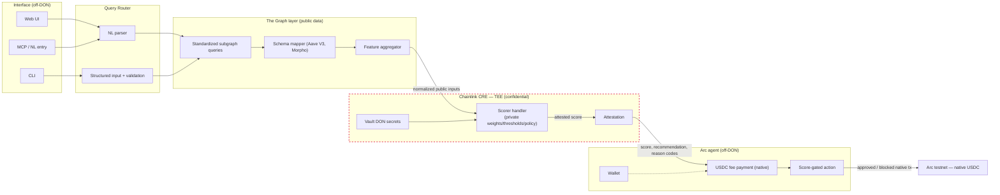

# PrivateSignal — Architecture Overview

PrivateSignal runs a **confidential cross-protocol risk-scoring** system: live,
standardized DeFi position data (The Graph) is fed into a **Chainlink CRE TEE**
that executes a private scoring model and emits **only an attested score**;
agents on **Arc** pay for that intelligence in native USDC and are gated by it.

> One sentence: PrivateSignal runs a private cross-protocol risk model inside a
> Chainlink TEE over live standardized Graph data — only a signed score leaves
> the enclave, so agents on Arc can pay for and act on confidential risk
> intelligence without leaking strategy.

This document is the product/architecture contract for the phased build. The
current committed baseline (the `privatesignal/` reference CRE workflow) is
described under [Baseline vs. target](#baseline-vs-target).

---

## Layers

| Layer | Responsibility | Execution context |
|-------|----------------|-------------------|
| **Interface** | Web UI, CLI, MCP/natural-language entry | Off-DON (Node) |
| **Query Router** | NL parsing → structured query plan; structured input validation | Off-DON (Node) |
| **The Graph layer** | Standardized subgraph queries (Aave V3, Morpho), schema mapping to a unified shape, cross-protocol feature aggregation | Off-DON (Node) |
| **Chainlink CRE** | Confidential TEE scorer (private weights/thresholds/policy), Vault DON secrets, attested execution | In-DON (WASM) |
| **Arc agent** | Wallet, native-USDC fee payment, score-gated action execution | Off-DON (Node) |
| **Blockchain** | Arc testnet (Circle L1) native-USDC transactions | Chain |

---

## End-to-end data flow

1. A caller submits a **natural-language** or **structured** query
   (`walletAddress`, `protocols[]`, `policyProfileId`).
2. The **query router** validates it and produces a normalized query plan.
3. The **Graph layer** runs standardized subgraph queries and maps each
   protocol's schema onto one unified shape, then aggregates cross-protocol
   features (`combinedCollateralValue`, `totalDebtUSD`, `concentrationScore`,
   `healthPressureIndex`, correlated-asset flags). These are the **public
   inputs**.
4. The normalized features enter the **CRE TEE handler**. The handler runs the
   private weighted model with Vault-DON secrets and returns a
   **score**, a coarse **recommendation**, coarse **reason codes**, and an
   **attestation**. No weights, thresholds, policy profiles, or intermediate
   calculations leave the enclave.
5. An **Arc agent** pays the oracle fee (native USDC, standard value transfer)
   and applies its local policy threshold against the attested score to approve
   or block its candidate action.

**Privacy boundary:** everything inside the dashed `CRE — TEE` group is
confidential. Only the signed output (score + coarse reason codes +
attestation) crosses the boundary.

---

## Privacy boundary (the core contract)

| Zone | Contents |
|------|----------|
| **Inside the TEE (private)** | Model weights, thresholds, policy profiles, strategy style, intermediate calculations |
| **Leaves the TEE (attested)** | Score, coarse recommendation (`safe` / `caution` / `high_risk`), coarse reason codes, attestation (DON ID, workflow ID, execution hash, timestamp) |
| **Public** | The Graph data (positions/features), query existence, Arc transactions (fee payment, gated action hashes) |

Enforced by:

- The TEE handler takes data **in as a parameter** and makes **no outbound
  requests**; there is nothing to exfiltrate at runtime.
- Private configuration is loaded from **Vault DON secrets**, referenced — never
  hardcoded.
- **No `console.log` / emitted value** inside the handler may contain weights,
  thresholds, or intermediate calculations. Logs and query history are
  redacted.
- The output envelope carries attestation so consumers can verify execution ran
  in the enclave.

---

## Execution contexts (two, not one)

| Context | Where | Rules |
|---------|-------|-------|
| **In-DON (WASM)** | CRE workflow/handlers (the confidential scorer) | QuickJS/WASM constraints: no Node built-ins, no browser globals, `@chainlink/cre-sdk` only, `runtime.now()`, deterministic, secret references only |
| **Off-DON (Node)** | `src/api`, Graph aggregator, `src/arc`, frontend | Normal Node.js processes (HTTP, DB, etc. allowed) — but must still honor the privacy contract and never handle/emit private model state |

**Arc-specific rule (applies in every layer that touches Arc):** on Arc
(Circle L1) **USDC is the native gas token**, not an ERC-20 contract. All
payments/actions are **native value transfers** — never ERC-20 `approve` /
`transfer` patterns.

---

## Baseline vs. target

**Committed baseline (working):** the `privatesignal/` package is a reference
CRE workflow — cron trigger → off-chain signal fetch across the DON with median
consensus → deterministic EVM calldata. It validates the toolchain
(typecheck + tests green) and the WASM rules, but it exercises the *node-mode
fetch* pattern, which is **not** the confidential-handler pattern the product
target uses.

**Target (phased build):** see [docs/build-plan.md](./build-plan.md). Phase 1
introduces the confidential TEE scorer + Vault secrets + deploy script; phases
2–7 add the Graph layer, API/UI, Arc agent, and validation around it.
